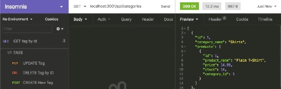

# E-Commerce Back-End
Summary - Interact with a complete E-Commerce back-end through a REST API client (such as Insomnia or Thunder Client). All routes implement each C.R.U.D. operation (create, read, update, delete) on an ORM database with Sequelize models.
#### Matilda Brantley
### [Project on GitHub](https://github.com/matildabrantley/e-commerce-back-end)

## Sequelize Models
### Fields with Types
* Product
  * product_name - STRING
  * price - DECIMAL
  * stock - INTEGER
  * category_id - INTEGER
  * id - INTEGER
* Category
  * category_name - STRING
  * id - INTEGER
* Tag
  * tag_name - STRING
  * id - INTEGER
* ProductTag
  * product_id - INTEGER
  * tag_id - INTEGER
  * id - INTEGER
## API Routes and Database Queries
* Product Routes
  * GET -  Product.findAll: retrieve all products, including their associated Category and Tag data
  * GET -  Product.findByPK: find one product by its `id` value, including its associated Products
  * POST -  Product.create: add new product
  * PUT - Product.update: edit a product by its `id` value
  * DELETE - Product.destroy: remove a product by its `id` value
* Category Routes
  * GET -  Category.findAll: retrieve all categories, including their associated Products
  * GET -  Category.findByPK: find one category by its `id` value, including its associated Products
  * POST -  Category.create: add new category
  * PUT - Category.update: edit a category by its `id` value
  * DELETE - Category.destroy: delete a category by its `id` value
* Tag Routes
  * GET -  Tag.findAll: retrieve all tags with their corresponding Products
  * GET -  Tag.findByPK: find one tag by its `id` value
  * POST -  Tag.create: add new tag
  * PUT - Tag.update: change a tag by its `id` value
  * DELETE - Tag.destroy: remove a tag by its `id` value

## Screenshot

## Tutorial with Insomnia
[Video Tutorial](https://watch.screencastify.com/v/TDIMNFJBHvn0ROBplMQk)
